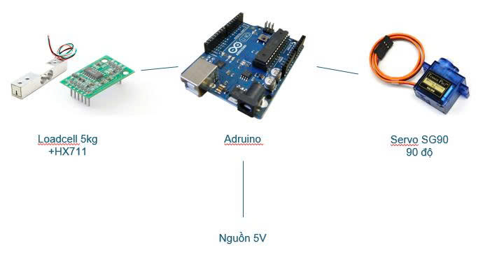
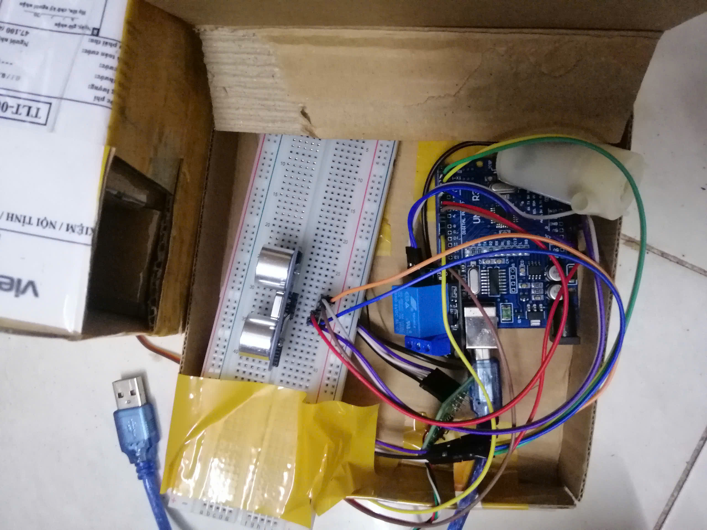
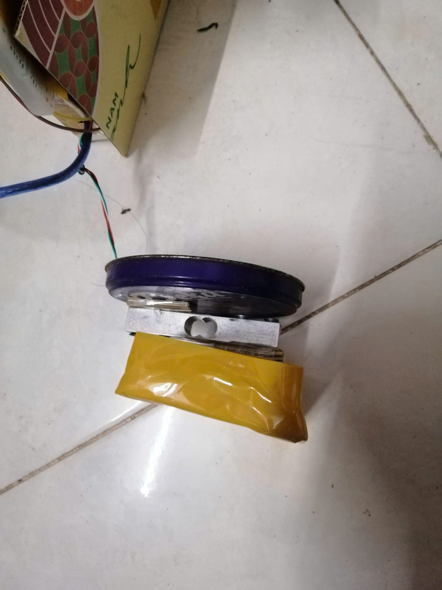
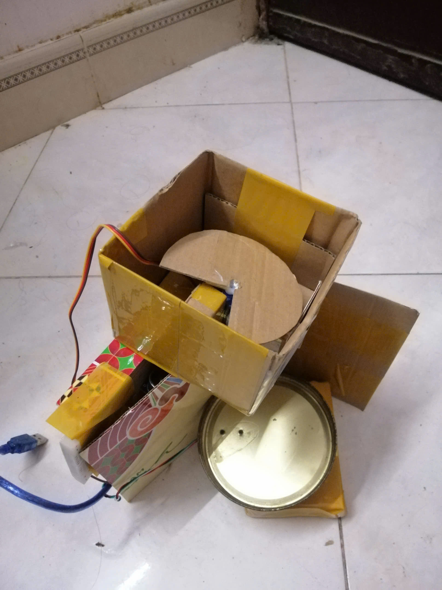

# Hệ Thống Cho Ăn Tự Động

[Tiếng Việt](#tiếng-việt) | [English](#english)

## Tiếng Việt

### Tổng quan
Đây là hệ thống cho ăn tự động dựa trên Arduino, sử dụng cảm biến trọng lượng (load cell) và động cơ servo để điều khiển việc cấp thức ăn. Hệ thống tự động mở khi mức thức ăn thấp và đóng khi đạt đến lượng mong muốn.

### Sơ đồ hệ thống

### Yêu cầu phần cứng
- Board Arduino (Uno/Nano/Pro Mini)
- Module khuếch đại HX711
- Cảm biến trọng lượng (Load Cell) 5kg
- Động cơ Servo 9g
- Dây kết nối
- Nguồn điện 5V

### Cấu hình chân
- Cảm biến trọng lượng:
  - DT: Chân 3
  - SCK: Chân 2
- Động cơ Servo: Chân 10

### Tính năng
- Giám sát trọng lượng tự động
- Điều khiển cấp thức ăn bằng servo
- Ngưỡng có thể cấu hình:
  - Mở khi trọng lượng < 30g
  - Đóng khi trọng lượng > 60g
- Hỗ trợ giám sát qua Serial
- Đọc trung bình 10 lần để tăng độ chính xác
- Tự động hiệu chuẩn khi khởi động

### Hiệu chuẩn
Hệ thống sử dụng hệ số hiệu chuẩn 420.0 cho cảm biến trọng lượng. Giá trị này có thể điều chỉnh tùy theo loại cảm biến cụ thể của bạn.

### Cách sử dụng
1. Kết nối phần cứng theo cấu hình chân
2. Tải code lên Arduino
3. Mở Serial Monitor (9600 baud) để giám sát hệ thống
4. Hệ thống sẽ tự động điều khiển servo dựa trên giá trị trọng lượng đọc được

### Hướng dẫn nối dây
#### Kết nối Load Cell với HX711
- Load Cell -> HX711:
  - Đỏ -> E+
  - Đen -> E-
  - Trắng -> A+
  - Xanh lá -> A-

#### Kết nối HX711 với Arduino
- HX711 -> Arduino:
  - VCC -> 5V
  - GND -> GND
  - DT -> D3
  - SCK -> D2

#### Kết nối Servo với Arduino
- Servo -> Arduino:
  - Dây đỏ -> 5V
  - Dây nâu/đen -> GND
  - Dây cam/vàng -> D10

### Lưu ý
- Đảm bảo nguồn điện ổn định
- Kiểm tra kết nối dây trước khi vận hành
- Có thể điều chỉnh các ngưỡng trong code để phù hợp với nhu cầu

### Hình ảnh minh họa

*Hình ảnh tổng thể hệ thống*

*Chi tiết kết nối load cell và servo*

*Giao diện điều khiển và giám sát*

---

## English

### Overview
This is an Arduino-based automatic feeding system that uses a load cell (weight sensor) and a servo motor to control food dispensing. The system automatically opens when the food level is low and closes when it reaches the desired amount.

### System Diagram

### Hardware Requirements
- Arduino board (Uno/Nano/Pro Mini)
- HX711 Load Cell Amplifier
- Load Cell (Weight Sensor) 5kg
- Servo Motor 9g
- Jumper wires
- 5V Power supply

### Pin Configuration
- Load Cell:
  - DT: Pin 3
  - SCK: Pin 2
- Servo Motor: Pin 10

### Features
- Automatic weight monitoring
- Servo-controlled food dispensing
- Configurable thresholds:
  - Opens when weight < 30g
  - Closes when weight > 60g
- Serial monitoring support
- 10-sample averaging for accuracy
- Auto-calibration on startup

### Calibration
The system uses a calibration factor of 420.0 for the load cell. This value can be adjusted based on your specific load cell.

### Usage
1. Connect the hardware according to the pin configuration
2. Upload the code to your Arduino
3. Open Serial Monitor (9600 baud) to monitor the system
4. The system will automatically control the servo based on the weight readings

### Wiring Guide
#### Load Cell to HX711 Connection
- Load Cell -> HX711:
  - Red -> E+
  - Black -> E-
  - White -> A+
  - Green -> A-

#### HX711 to Arduino Connection
- HX711 -> Arduino:
  - VCC -> 5V
  - GND -> GND
  - DT -> D3
  - SCK -> D2

#### Servo to Arduino Connection
- Servo -> Arduino:
  - Red wire -> 5V
  - Brown/Black wire -> GND
  - Orange/Yellow wire -> D10

### Notes
- Ensure stable power supply
- Check wire connections before operation
- Thresholds can be adjusted in the code to suit your needs

### Illustrative Images

*Overall system view*

*Load cell and servo connection details*

*Control and monitoring interface* 